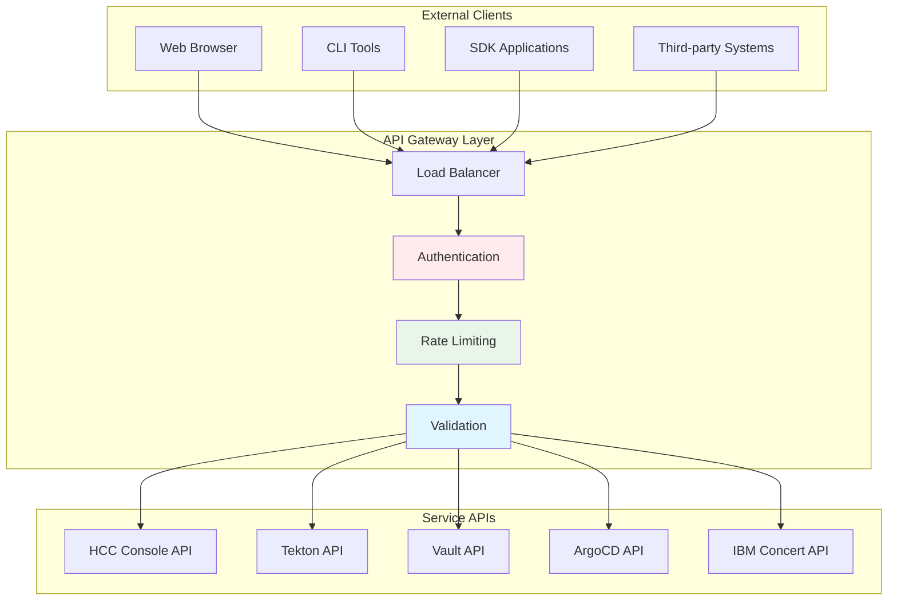
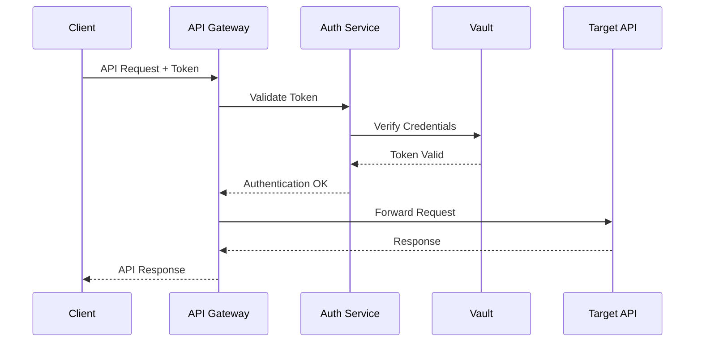

# IBM HCC Control Plane - API & Integration Guide

## Overview

This document provides comprehensive API documentation and integration guidelines for the IBM Consulting Hybrid Cloud Console (HCC) Control Plane. It covers REST APIs, GraphQL endpoints, webhook integrations, and SDK usage for building applications and integrations with the HCC platform.

## API Architecture

### API Gateway Structure


### Authentication Flow


## HCC Console API

### Base URL
```
Production: https://console.hcc.eu-de-sbx.cloudaccelerator.ibm.com/api
Staging: https://staging-console.hcc.eu-de-sbx.cloudaccelerator.ibm.com/api
```

### Authentication
```bash
# OAuth Token Authentication
curl -H "Authorization: Bearer $GITHUB_TOKEN" \
     https://console.hcc.eu-de-sbx.cloudaccelerator.ibm.com/api/catalog/entities
```

### Core Endpoints

#### Software Catalog API

**List Entities**
```http
GET /api/catalog/entities
Accept: application/json
Authorization: Bearer <token>

Query Parameters:
- filter: string (optional) - Filter expression
- limit: integer (optional) - Number of results (default: 20, max: 100)
- offset: integer (optional) - Pagination offset
- orderBy: string (optional) - Sort field and direction

Example:
GET /api/catalog/entities?filter=kind=component&limit=50&orderBy=meta.name
```

```json
{
  "entities": [
    {
      "apiVersion": "backstage.io/v1alpha1",
      "kind": "Component",
      "meta": {
        "name": "hcc-console",
        "namespace": "default",
        "title": "IBM HCC Console",
        "description": "Primary frontend interface for hybrid cloud management",
        "tags": ["frontend", "backstage", "web-console"],
        "links": [
          {
            "url": "https://console.hcc.eu-de-sbx.cloudaccelerator.ibm.com",
            "title": "Production Console",
            "icon": "web"
          }
        ]
      },
      "spec": {
        "type": "service",
        "lifecycle": "production",
        "owner": "platform-team",
        "system": "hcc-control-plane"
      },
      "relations": [
        {
          "type": "ownedBy",
          "targetRef": "group:platform-team"
        }
      ]
    }
  ],
  "totalCount": 45,
  "pageInfo": {
    "hasNextPage": true,
    "hasPreviousPage": false,
    "startCursor": "0",
    "endCursor": "49"
  }
}
```

**Get Specific Entity**
```http
GET /api/catalog/entities/by-name/{kind}/{namespace}/{name}
Accept: application/json
Authorization: Bearer <token>

Example:
GET /api/catalog/entities/by-name/component/default/hcc-console
```

**Create Entity**
```http
POST /api/catalog/entities
Content-Type: application/json
Authorization: Bearer <token>

{
  "apiVersion": "backstage.io/v1alpha1",
  "kind": "Component",
  "meta": {
    "name": "my-new-service",
    "title": "My New Service",
    "description": "A new microservice for the platform"
  },
  "spec": {
    "type": "service",
    "lifecycle": "development",
    "owner": "team-alpha"
  }
}
```

#### Scaffolder API

**List Templates**
```http
GET /api/scaffolder/v2/templates
Accept: application/json
Authorization: Bearer <token>

Query Parameters:
- filter: string (optional) - Template filter
- orderBy: string (optional) - Sort order
```

```json
{
  "templates": [
    {
      "apiVersion": "scaffolder.backstage.io/v1beta3",
      "kind": "Template",
      "meta": {
        "name": "spring-boot-microservice",
        "title": "Spring Boot Microservice",
        "description": "Production-ready Spring Boot microservice with monitoring and security",
        "tags": ["java", "spring-boot", "microservice"]
      },
      "spec": {
        "owner": "platform-team",
        "type": "service",
        "parameters": [
          {
            "title": "Application Information",
            "required": ["name", "owner"],
            "properties": {
              "name": {
                "title": "Name",
                "type": "string",
                "pattern": "^[a-zA-Z0-9-]+$"
              },
              "owner": {
                "title": "Owner",
                "type": "string",
                "ui:field": "OwnerPicker"
              }
            }
          }
        ]
      }
    }
  ]
}
```

**Execute Template**
```http
POST /api/scaffolder/v2/tasks
Content-Type: application/json
Authorization: Bearer <token>

{
  "templateRef": "template:default/spring-boot-microservice",
  "values": {
    "name": "my-new-app",
    "owner": "team-alpha",
    "description": "New application for processing data",
    "database": "postgresql",
    "monitoring": true
  }
}
```

**Get Task Status**
```http
GET /api/scaffolder/v2/tasks/{taskId}
Accept: application/json
Authorization: Bearer <token>

Response:
{
  "id": "task-123-456",
  "status": "completed",
  "createdAt": "2024-01-15T10:30:00Z",
  "completedAt": "2024-01-15T10:35:00Z",
  "spec": {
    "templateInfo": {
      "entityRef": "template:default/spring-boot-microservice"
    },
    "values": {
      "name": "my-new-app",
      "owner": "team-alpha"
    }
  },
  "output": {
    "repositoryUrl": "https://github.com/ibmc-hcc-sandbox/my-new-app",
    "catalogEntityUrl": "https://console.hcc.eu-de-sbx.cloudaccelerator.ibm.com/catalog/default/component/my-new-app"
  }
}
```

#### TechDocs API

**Get Documentation**
```http
GET /api/techdocs/default/component/{entityName}
Accept: application/json
Authorization: Bearer <token>

Response:
{
  "entityName": {
    "kind": "component",
    "namespace": "default",
    "name": "hcc-console"
  },
  "files": [
    {
      "name": "index.md",
      "path": "/",
      "lastModified": "2024-01-15T10:30:00Z"
    }
  ],
  "etag": "abc123def456"
}
```

## Tekton API Integration

### Pipeline Management

**List Pipelines**
```bash
# Using Tekton CLI
tkn pipeline list -o json

# Using kubectl
kubectl get pipelines -n hcc-pipelines -o json

# Using REST API
curl -H "Authorization: Bearer $K8S_TOKEN" \
     https://api.hcc-cluster.com/apis/tekton.dev/v1beta1/namespaces/hcc-pipelines/pipelines
```

**Create Pipeline Run**
```yaml
apiVersion: tekton.dev/v1beta1
kind: PipelineRun
meta
  generateName: golden-path-deploy-
  namespace: hcc-pipelines
spec:
  pipelineRef:
    name: golden-path-deployment
  params:
  - name: template-name
    value: "spring-boot-microservice"
  - name: target-environment
    value: "development"
  - name: git-url
    value: "https://github.com/ibmc-hcc-sandbox/my-new-app"
  workspaces:
  - name: shared-data
    persistentVolumeClaim:
      claimName: pipeline-workspace-pvc
  - name: git-credentials
    secret:
      secretName: git-credentials
```

**Monitor Pipeline Execution**
```bash
# Get pipeline run status
tkn pipelinerun describe golden-path-deploy-xyz

# Stream logs
tkn pipelinerun logs -f golden-path-deploy-xyz

# Get pipeline run events
kubectl get events --field-selector involvedObject.name=golden-path-deploy-xyz
```

### Custom Task Integration

**Task Definition**
```yaml
apiVersion: tekton.dev/v1beta1
kind: Task
meta
  name: hcc-custom-deployment
  namespace: hcc-pipelines
spec:
  description: Custom deployment task for HCC templates
  params:
  - name: template-name
    type: string
    description: Name of the Golden Path Template
  - name: environment
    type: string
    description: Target environment
  - name: config-overrides
    type: string
    description: JSON configuration overrides
    default: "{}"
  results:
  - name: deployment-url
    description: URL of deployed application
  - name: health-check-url
    description: Health check endpoint URL
  steps:
  - name: deploy
    image: registry.eu-de.containers.appdomain.cloud/hcc-sandbox/deployer:latest
    env:
    - name: VAULT_ADDR
      value: https://vault.hcc.eu-de-sbx.cloudaccelerator.ibm.com
    - name: VAULT_TOKEN
      valueFrom:
        secretKeyRef:
          name: vault-token
          key: token
    script: |
      #!/bin/bash
      set -e
      
      # Fetch deployment configuration from Vault
      DEPLOY_CONFIG=$(vault kv get -format=json secret/deployments/$(params.template-name))
      
      # Merge with user overrides
      FINAL_CONFIG=$(echo "$DEPLOY_CONFIG" | jq --argjson overrides '$(params.config-overrides)' '.data.data + $overrides')
      
      # Execute deployment
      ./deploy.sh --template $(params.template-name) \
                  --environment $(params.environment) \
                  --config "$FINAL_CONFIG"
      
      # Output results
      echo -n "https://$(params.template-name)-$(params.environment).apps.hcc-cluster.com" | tee $(results.deployment-url.path)
      echo -n "https://$(params.template-name)-$(params.environment).apps.hcc-cluster.com/health" | tee $(results.health-check-url.path)
```

## Vault API Integration

### Secret Management

**Read Secret**
```bash
# Using Vault CLI
vault kv get secret/hcc/database

# Using curl
curl -H "X-Vault-Token: $VAULT_TOKEN" \
     https://vault.hcc.eu-de-sbx.cloudaccelerator.ibm.com/v1/secret/data/hcc/database
```

**Write Secret**
```bash
# Using Vault CLI
vault kv put secret/hcc/new-service \
  database_url="postgresql://localhost:5432/mydb" \
  api_key="secret-key-123"

# Using curl
curl -H "X-Vault-Token: $VAULT_TOKEN" \
     -H "Content-Type: application/json" \
     -d '{"data": {"database_url": "postgresql://localhost:5432/mydb", "api_key": "secret-key-123"}}' \
     https://vault.hcc.eu-de-sbx.cloudaccelerator.ibm.com/v1/secret/data/hcc/new-service
```

### Dynamic Secrets

**Database Credentials**
```bash
# Get temporary database credentials
vault read database/creds/hcc-console

# Response:
# Key                Value
# ---                -----
# lease_id           database/creds/hcc-console/abc123
# lease_duration     1h
# lease_renewable    true
# password          A1a-randompassword
# username          v-kubernete-hcc-console-xyz123
```

### Authentication

**Kubernetes Auth**
```bash
# Authenticate using service account token
JWT=$(cat /var/run/secrets/kubernetes.io/serviceaccount/token)
curl -X POST \
     -H "Content-Type: application/json" \
     -d "{\"jwt\": \"$JWT\", \"role\": \"hcc-console\"}" \
     https://vault.hcc.eu-de-sbx.cloudaccelerator.ibm.com/v1/auth/kubernetes/login
```

## ArgoCD API Integration

### Application Management

**List Applications**
```bash
# Using ArgoCD CLI
argocd app list -o json

# Using REST API
curl -H "Authorization: Bearer $ARGOCD_TOKEN" \
     https://gitops.hcc.eu-de-sbx.cloudaccelerator.ibm.com/api/v1/applications
```

**Get Application Details**
```bash
# Using ArgoCD CLI
argocd app get my-application -o json

# Response includes:
{
  "metadata": {
    "name": "my-application",
    "namespace": "argocd"
  },
  "spec": {
    "project": "default",
    "source": {
      "repoURL": "https://github.com/ibmc-hcc-sandbox/my-application",
      "path": "k8s/overlays/prod",
      "targetRevision": "HEAD"
    },
    "destination": {
      "server": "https://kubernetes.default.svc",
      "namespace": "my-application-prod"
    }
  },
  "status": {
    "health": {
      "status": "Healthy"
    },
    "sync": {
      "status": "Synced",
      "revision": "abc123def456"
    }
  }
}
```

**Sync Application**
```bash
# Using ArgoCD CLI
argocd app sync my-application

# Using REST API
curl -X POST \
     -