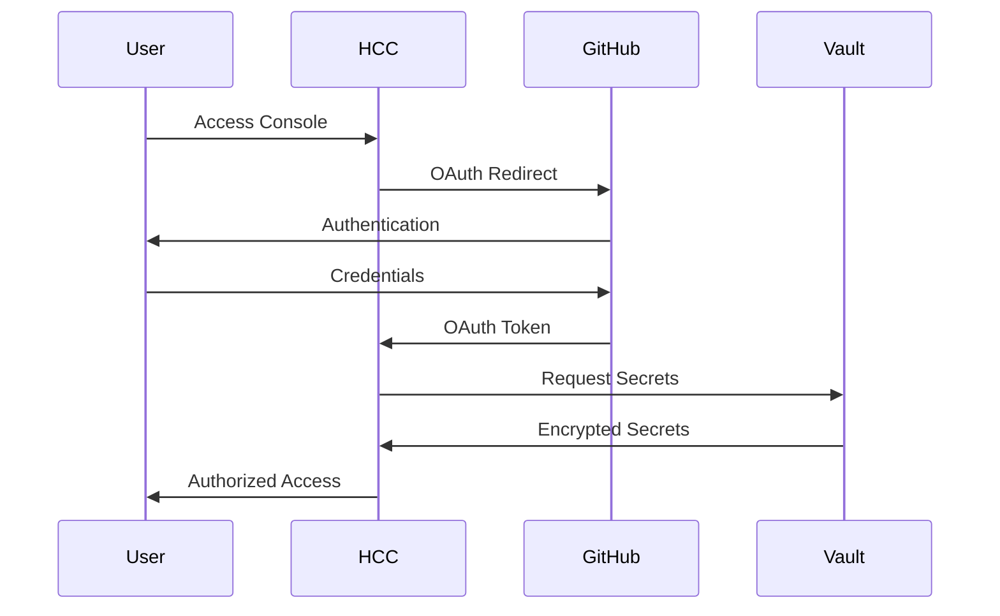

# IBM Consulting Hybrid Cloud Console (HCC) - Component Documentation

## Overview

The IBM Consulting Hybrid Cloud Console (HCC) serves as the primary frontend interface for the hybrid cloud control plane, providing developers and platform engineers with a unified portal for managing infrastructure, deploying applications, and orchestrating cloud operations.

## Technical Specifications

- **Framework**: Backstage (Spotify's Developer Portal)
- **Deployment**: OpenShift Container Platform
- **URL**: https://console.hcc.eu-de-sbx.cloudaccelerator.ibm.com/
- **Authentication**: GitHub SSO
- **Language**: TypeScript/React

## Key Features

### 1. OS Patching Operations
- **Automated Patch Management**: Schedule and execute OS patches across hybrid environments
- **Compliance Tracking**: Monitor patch compliance status and reporting
- **Risk Assessment**: Pre-deployment vulnerability analysis
- **Rollback Capabilities**: Automated rollback mechanisms for failed patches

### 2. Infrastructure Blueprint Design
- **Visual Designer**: Drag-and-drop infrastructure component design
- **Template Library**: Pre-built infrastructure patterns and best practices
- **Validation Engine**: Real-time configuration validation and cost estimation
- **Version Control**: Blueprint versioning and change tracking

### 3. Golden Path Templates
- **Template Catalog**: Browse and discover standardized deployment templates
- **Scaffolder Integration**: One-click deployment via Backstage Scaffolder
- **Parameter Customization**: Template customization with guided parameters
- **Deployment Tracking**: Real-time deployment status and monitoring

### 4. Platform Engineering Workflows
- **Service Catalog**: Comprehensive view of all platform services
- **Dependency Mapping**: Visualize service dependencies and relationships
- **Health Dashboards**: Real-time platform health and performance metrics
- **Incident Management**: Integrated alerting and incident response

## Architecture Components

### Frontend Layer
```
┌─────────────────────────────────────────┐
│             React Frontend              │
├─────────────────────────────────────────┤
│          Backstage Core                 │
├─────────────────────────────────────────┤
│         Custom Plugins                  │
│  ┌─────────┬─────────┬─────────────────┐│
│  │IBM Cloud│ Tekton  │   Vault         ││
│  │Plugin   │ Plugin  │   Plugin        ││
│  └─────────┴─────────┴─────────────────┘│
└─────────────────────────────────────────┘
```

### Custom Plugins

#### IBM Cloud Plugin
- **Purpose**: Native integration with IBM Cloud services
- **Features**:
  - Resource provisioning and management
  - Cost monitoring and optimization
  - Security posture assessment
  - Compliance reporting

#### Tekton Plugin
- **Purpose**: CI/CD pipeline management and monitoring
- **Features**:
  - Pipeline creation and configuration
  - Execution monitoring and logs
  - Resource usage analytics
  - Performance optimization recommendations

#### Vault Plugin
- **Purpose**: Secret management interface
- **Features**:
  - Secret discovery and access
  - Policy management
  - Audit trail visualization
  - Rotation scheduling

## Integration Points

### Backend Services

#### HashiCorp Vault
- **Connection**: REST API over HTTPS
- **Authentication**: Kubernetes Service Account
- **Purpose**: Secure secret retrieval and management
- **Endpoints**:
  - `/v1/auth/kubernetes/login` - Authentication
  - `/v1/secret/data/*` - Secret operations
  - `/v1/sys/policies/acl/*` - Policy management

#### Tekton Pipelines
- **Connection**: Kubernetes API
- **Authentication**: RBAC with service account
- **Purpose**: Pipeline orchestration and monitoring
- **Resources**:
  - `PipelineRun` - Pipeline execution status
  - `TaskRun` - Individual task monitoring
  - `Pipeline` - Pipeline definitions
  - `Task` - Reusable task components

#### ArgoCD
- **Connection**: gRPC/REST API
- **Authentication**: OIDC with GitHub
- **Purpose**: GitOps application management
- **Features**:
  - Application synchronization status
  - Deployment history and rollbacks
  - Resource health monitoring
  - Configuration drift detection

#### IBM Concert
- **Connection**: REST API over HTTPS
- **Authentication**: API Key (stored in Vault)
- **Purpose**: Complex workflow orchestration
- **Capabilities**:
  - Multi-cloud workflow execution
  - Resource lifecycle management
  - Cross-cloud networking
  - Compliance enforcement

## Security Implementation

### Authentication Flow


### Authorization Model
- **RBAC Integration**: Kubernetes Role-Based Access Control
- **GitHub Teams**: Authorization based on GitHub organization membership
- **Vault Policies**: Secret access controlled by Vault policies
- **Audit Logging**: Comprehensive audit trail for all operations

### Security Controls
- **TLS Encryption**: All communications encrypted in transit
- **Secret Management**: No secrets stored in application code
- **Session Management**: Secure session handling with timeout
- **CSRF Protection**: Cross-site request forgery protection
- **Content Security Policy**: Restrictive CSP headers

## Configuration Management

### Environment Variables
```yaml
# Backstage Configuration
BACKSTAGE_BASE_URL: https://console.hcc.eu-de-sbx.cloudaccelerator.ibm.com
POSTGRES_HOST: postgresql.hcc-system.svc.cluster.local
POSTGRES_PORT: 5432
POSTGRES_USER: backstage
POSTGRES_PASSWORD_FILE: /vault/secrets/postgres-password

# GitHub Integration
GITHUB_CLIENT_ID: vault:secret/github#client_id
GITHUB_CLIENT_SECRET: vault:secret/github#client_secret
GITHUB_ORG: ibmc-hcc-sandbox

# Vault Integration
VAULT_ADDR: https://vault.hcc.eu-de-sbx.cloudaccelerator.ibm.com
VAULT_NAMESPACE: hcc-system
VAULT_ROLE: backstage-reader

# Kubernetes Integration
KUBERNETES_SERVICE_ACCOUNT_TOKEN: /var/run/secrets/kubernetes.io/serviceaccount/token
KUBERNETES_CA_FILE: /var/run/secrets/kubernetes.io/serviceaccount/ca.crt
```

### Plugin Configuration
```yaml
# app-config.yaml
integrations:
  github:
    - host: github.com
      apps:
        - appId: ${GITHUB_APP_ID}
          privateKey: ${GITHUB_PRIVATE_KEY}
          installationId: ${GITHUB_INSTALLATION_ID}

vault:
  baseUrl: ${VAULT_ADDR}
  token: ${VAULT_TOKEN}
  kvVersion: 2
  namespace: ${VAULT_NAMESPACE}

kubernetes:
  serviceLocatorMethod:
    type: 'multiTenant'
  clusterLocatorMethods:
    - type: 'config'
      clusters:
        - url: https://kubernetes.default.svc
          name: local-cluster
          authProvider: serviceAccount
          serviceAccountToken: ${KUBERNETES_SERVICE_ACCOUNT_TOKEN}
```

## Monitoring and Observability

### Metrics Collection
- **Application Metrics**: Performance, errors, and usage statistics
- **Infrastructure Metrics**: Resource utilization and health
- **Business Metrics**: Template usage, deployment success rates
- **Security Metrics**: Authentication events, authorization failures

### Logging Strategy
- **Structured Logging**: JSON format with consistent field naming
- **Log Aggregation**: Centralized logging via OpenShift logging stack
- **Log Retention**: 90-day retention for audit compliance
- **Alert Integration**: Real-time alerting on error conditions

### Health Checks
- **Liveness Probe**: `/healthz` endpoint for container health
- **Readiness Probe**: `/ready` endpoint for traffic routing
- **Deep Health Check**: `/health` endpoint with dependency status
- **Metrics Endpoint**: `/metrics` for Prometheus scraping

## Deployment Architecture

### Container Specifications
```yaml
apiVersion: apps/v1
kind: Deployment
meta
  name: hcc-console
  namespace: hcc-system
spec:
  replicas: 3
  selector:
    matchLabels:
      app: hcc-console
  template:
    metadata:
      labels:
        app: hcc-console
    spec:
      serviceAccountName: hcc-console
      containers:
      - name: backstage
        image: registry.eu-de.containers.appdomain.cloud/hcc-sandbox/backstage:latest
        ports:
        - containerPort: 7007
        env:
        - name: NODE_ENV
          value: production
        - name: POSTGRES_PASSWORD
          valueFrom:
            secretKeyRef:
              name: postgres-credentials
              key: password
        resources:
          requests:
            memory: "512Mi"
            cpu: "250m"
          limits:
            memory: "1Gi"
            cpu: "500m"
        livenessProbe:
          httpGet:
            path: /healthz
            port: 7007
          initialDelaySeconds: 30
          periodSeconds: 10
        readinessProbe:
          httpGet:
            path: /ready
            port: 7007
          initialDelaySeconds: 15
          periodSeconds: 5
```

### Service Configuration
```yaml
apiVersion: v1
kind: Service
metadata:
  name: hcc-console-service
  namespace: hcc-system
spec:
  selector:
    app: hcc-console
  ports:
  - port: 80
    targetPort: 7007
    protocol: TCP
  type: ClusterIP
```

## Troubleshooting Guide

### Common Issues

#### Authentication Failures
- **Symptoms**: Unable to log in via GitHub
- **Causes**: 
  - Expired GitHub OAuth tokens
  - Incorrect GitHub app configuration
  - Vault secret access issues
- **Resolution**:
  1. Verify GitHub OAuth app settings
  2. Check Vault secret accessibility
  3. Review service account permissions

#### Plugin Loading Errors
- **Symptoms**: Plugins not appearing in interface
- **Causes**:
  - Missing environment variables
  - Network connectivity issues
  - Service account permission problems
- **Resolution**:
  1. Validate plugin configuration
  2. Test backend service connectivity
  3. Review RBAC permissions

#### Performance Issues
- **Symptoms**: Slow page loads, timeouts
- **Causes**:
  - Resource constraints
  - Database connectivity issues
  - Inefficient queries
- **Resolution**:
  1. Check resource utilization
  2. Monitor database performance
  3. Review application logs

### Diagnostic Commands
```bash
# Check pod status
kubectl get pods -n hcc-system -l app=hcc-console

# View application logs
kubectl logs -f deployment/hcc-console -n hcc-system

# Check service connectivity
kubectl exec -it deployment/hcc-console -n hcc-system -- curl localhost:7007/healthz

# Validate configuration
kubectl get configmap hcc-console-config -n hcc-system -o yaml
```

## API Reference

### Health Endpoints
- `GET /healthz` - Liveness check
- `GET /ready` - Readiness check
- `GET /health` - Detailed health status

### Authentication Endpoints
- `GET /api/auth/github` - GitHub OAuth initiation
- `POST /api/auth/github/handler/frame` - OAuth callback handler
- `GET /api/auth/logout` - Session termination

### Catalog API
- `GET /api/catalog/entities` - List all entities
- `GET /api/catalog/entities/{kind}/{namespace}/{name}` - Get specific entity
- `POST /api/catalog/entities` - Create new entity
- `PUT /api/catalog/entities/{kind}/{namespace}/{name}` - Update entity

### Scaffolder API
- `GET /api/scaffolder/v2/templates` - List templates
- `POST /api/scaffolder/v2/tasks` - Execute template
- `GET /api/scaffolder/v2/tasks/{taskId}` - Get task status

## Maintenance Procedures

### Regular Maintenance
- **Database Cleanup**: Weekly cleanup of old catalog entries
- **Log Rotation**: Daily log rotation and archival
- **Security Updates**: Monthly security patch updates
- **Plugin Updates**: Quarterly plugin version updates

### Backup Procedures
- **Configuration Backup**: Daily backup of configuration files
- **Database Backup**: Nightly PostgreSQL database backup
- **Secret Backup**: Weekly encrypted backup of Vault secrets
- **Image Backup**: Monthly backup of container images

### Update Process
1. **Staging Deployment**: Deploy updates to staging environment
2. **Testing Phase**: Comprehensive testing of all functionalities
3. **Approval Gate**: Security and performance review
4. **Production Deployment**: Rolling update to production
5. **Post-Deployment Validation**: Verify all services operational