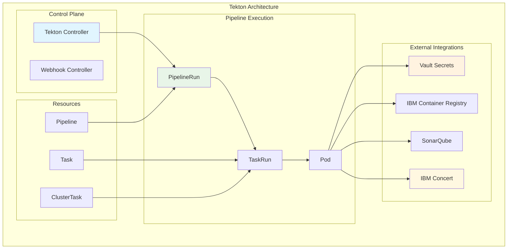
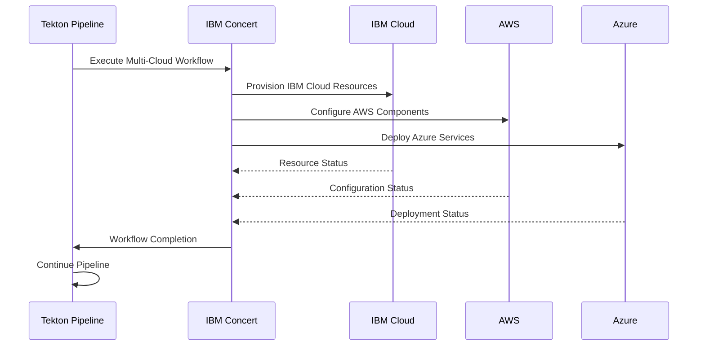

# Tekton Pipeline Engine - Component Documentation

## Overview

Tekton Pipelines serves as the cloud-native CI/CD engine for the IBM HCC Control Plane, orchestrating Golden Path Template deployments and infrastructure automation. It provides a Kubernetes-native approach to building, testing, and deploying applications with deep integration into IBM Concert workflows for complex multi-cloud orchestration.

## Technical Specifications

- **Platform**: Kubernetes-native (OpenShift)
- **Version**: Tekton Pipelines v0.53+
- **Namespace**: `tekton-pipelines`
- **Integration**: IBM Concert, HashiCorp Vault, SonarQube
- **Registry**: IBM Cloud Container Registry

## Architecture Overview



## Core Components

### Pipeline Controller
- **Responsibility**: Manages pipeline lifecycle and orchestration
- **Features**:
  - Pipeline execution scheduling
  - Resource state management
  - Event generation and handling
  - Garbage collection

### Webhook Controller
- **Responsibility**: Admission control and validation
- **Features**:
  - Resource validation
  - Default value injection
  - Conversion between API versions
  - Security policy enforcement

### Pipeline Resources

#### Pipeline Definitions
```yaml
apiVersion: tekton.dev/v1beta1
kind: Pipeline
meta
  name: golden-path-deployment
  namespace: hcc-pipelines
spec:
  description: Golden Path Template deployment pipeline
  params:
  - name: template-name
    type: string
    description: Name of the Golden Path Template
  - name: target-environment
    type: string
    description: Target deployment environment
  workspaces:
  - name: shared-data
  - name: git-credentials
  tasks:
  - name: fetch-template
    taskRef:
      name: git-clone
    workspaces:
    - name: output
      workspace: shared-data
    params:
    - name: url
      value: https://github.com/ibmc-hcc-sandbox/golden-path-templates
  - name: security-scan
    taskRef:
      name: sonarqube-scanner
    runAfter: ["fetch-template"]
    workspaces:
    - name: source
      workspace: shared-data
  - name: build-image
    taskRef:
      name: buildah
    runAfter: ["security-scan"]
    workspaces:
    - name: source
      workspace: shared-data
    params:
    - name: IMAGE
      value: registry.eu-de.containers.appdomain.cloud/hcc-sandbox/$(params.template-name):latest
  - name: deploy-infrastructure
    taskRef:
      name: concert-orchestration
    runAfter: ["build-image"]
    params:
    - name: workflow-name
      value: $(params.template-name)-deployment
    - name: environment
      value: $(params.target-environment)
  - name: verify-deployment
    taskRef:
      name: deployment-verification
    runAfter: ["deploy-infrastructure"]
```

#### Task Definitions
```yaml
apiVersion: tekton.dev/v1beta1
kind: Task
meta
  name: concert-orchestration
  namespace: hcc-pipelines
spec:
  description: Execute IBM Concert workflow
  params:
  - name: workflow-name
    type: string
  - name: environment
    type: string
  steps:
  - name: execute-workflow
    image: registry.eu-de.containers.appdomain.cloud/hcc-sandbox/concert-cli:latest
    env:
    - name: CONCERT_API_KEY
      valueFrom:
        secretKeyRef:
          name: concert-credentials
          key: api-key
    script: |
      #!/bin/bash
      set -e
      
      # Authenticate with IBM Concert
      concert auth login --api-key $CONCERT_API_KEY
      
      # Execute workflow
      concert workflow execute \
        --name $(params.workflow-name) \
        --environment $(params.environment) \
        --wait
      
      # Capture execution results
      concert workflow status --name $(params.workflow-name) > /workspace/results/status.json
  results:
  - name: workflow-status
    description: Concert workflow execution status
```

## Golden Path Template Integration

### Template Structure
```
golden-path-templates/
├── infrastructure/
│   ├── kubernetes-cluster/
│   ├── database-service/
│   └── monitoring-stack/
├── application/
│   ├── microservice/
│   ├── web-application/
│   └── batch-job/
└── security/
    ├── vault-setup/
    ├── network-policies/
    └── rbac-config/
```

### Template Execution Flow
1. **Template Discovery**: HCC Console triggers template deployment
2. **Parameter Collection**: User provides required parameters via UI
3. **Pipeline Instantiation**: Tekton creates PipelineRun with parameters
4. **Source Retrieval**: Git clone of template repository
5. **Security Scanning**: SonarQube analysis of template code
6. **Image Building**: Container image creation and registry push
7. **Concert Orchestration**: Multi-cloud infrastructure deployment
8. **Verification**: Deployment health and compliance checks
9. **Notification**: Results reported back to HCC Console

### Template Categories

#### Infrastructure Templates
- **Kubernetes Cluster**: Complete cluster setup with networking
- **Database Services**: PostgreSQL, MongoDB, Redis configurations
- **Monitoring Stack**: Prometheus, Grafana, AlertManager
- **Security Services**: Vault, Keycloak, Certificate management

#### Application Templates
- **Microservice**: Spring Boot, Node.js, Go applications
- **Web Application**: React, Angular, Vue.js frontends
- **Batch Jobs**: ETL processes, data processing pipelines
- **API Gateway**: Kong, Istio gateway configurations

#### Security Templates
- **Network Policies**: Kubernetes network segmentation
- **RBAC Configuration**: Role-based access control setup
- **Secret Management**: Vault integration and policies
- **Compliance**: SOC2, PCI-DSS configuration templates

## IBM Concert Integration

### Workflow Architecture


### Concert Workflow Examples

#### Multi-Cloud Database Setup
```yaml
apiVersion: concert.ibm.com/v1
kind: Workflow
meta
  name: multi-cloud-database
spec:
  description: Deploy database across multiple cloud providers
  steps:
  - name: provision-ibm-cloud-db
    provider: ibm-cloud
    service: cloudant
    config:
      plan: standard
      region: eu-de
      replicas: 3
  - name: setup-aws-backup
    provider: aws
    service: rds
    dependencies: ["provision-ibm-cloud-db"]
    config:
      engine: postgresql
      backup_retention: 30
      region: eu-central-1
  - name: configure-azure-monitoring
    provider: azure
    service: monitor
    dependencies: ["provision-ibm-cloud-db", "setup-aws-backup"]
    config:
      workspace: hcc-monitoring
      alerts: database-alerts.json
```

## Security Implementation

### Secret Management with Vault

#### Vault Integration
```yaml
apiVersion: v1
kind: ServiceAccount
meta
  name: tekton-vault-sa
  namespace: hcc-pipelines
  annotations:
    vault.hashicorp.com/agent-inject: "true"
    vault.hashicorp.com/role: "tekton-pipelines"
    vault.hashicorp.com/agent-inject-secret-db-credentials: "database/creds/mydb"
    vault.hashicorp.com/agent-inject-template-db-credentials: |
      {{- with secret "database/creds/mydb" -}}
      export DB_USERNAME="{{ .Data.username }}"
      export DB_PASSWORD="{{ .Data.password }}"
      {{- end -}}
```

#### Secret Access Policies
```hcl
# Vault Policy for Tekton Pipelines
path "secret/data/hcc/pipelines/*" {
  capabilities = ["read"]
}

path "database/creds/+/*" {
  capabilities = ["read"]
}

path "pki/issue/hcc-pipelines" {
  capabilities = ["create", "update"]
}
```

### Security Scanning Integration

#### SonarQube Task Configuration
```yaml
apiVersion: tekton.dev/v1beta1
kind: Task
meta
  name: sonarqube-scanner
spec:
  description: SonarQube security and quality analysis
  params:
  - name: project-key
    type: string
  - name: source-path
    type: string
    default: "."
  workspaces:
  - name: source
  steps:
  - name: sonar-scanner
    image: sonarsource/sonar-scanner-cli:latest
    env:
    - name: SONAR_HOST_URL
      valueFrom:
        secretKeyRef:
          name: sonarqube-config
          key: host-url
    - name: SONAR_LOGIN
      valueFrom:
        secretKeyRef:
          name: sonarqube-config
          key: token
    script: |
      #!/bin/bash
      cd /workspace/source/$(params.source-path)
      
      sonar-scanner \
        -Dsonar.projectKey=$(params.project-key) \
        -Dsonar.sources=. \
        -Dsonar.host.url=$SONAR_HOST_URL \
        -Dsonar.login=$SONAR_LOGIN \
        -Dsonar.qualitygate.wait=true
```

### Image Security

#### Buildah Security Configuration
```yaml
- name: build-secure-image
  taskRef:
    name: buildah
  params:
  - name: IMAGE
    value: $(params.image-url)
  - name: DOCKERFILE
    value: ./Dockerfile.secure
  - name: CONTEXT
    value: /workspace/source
  - name: FORMAT
    value: oci
  - name: BUILD_EXTRA_ARGS
    value: |
      --security-opt label=disable
      --cap-drop=ALL
      --cap-add=NET_BIND_SERVICE
      --no-new-privileges
```

## Monitoring and Observability

### Pipeline Metrics
- **Execution Time**: Average, P95, P99 pipeline duration
- **Success Rate**: Pipeline success/failure ratio
- **Resource Utilization**: CPU, memory, storage usage
- **Queue Time**: Time spent waiting for resources

### Task-Level Monitoring
- **Task Duration**: Individual task execution times
- **Step Performance**: Granular step-level metrics
- **Resource Consumption**: Per-task resource usage
- **Error Rates**: Task failure analysis

### Custom Metrics
```yaml
apiVersion: v1
kind: ConfigMap
metadata:
  name: tekton-metrics-config
  namespace: tekton-pipelines

  metrics.yaml: |
    metrics:
      pipeline-duration:
        type: histogram
        description: "Pipeline execution duration"
        labels: ["pipeline", "namespace", "status"]
      
      task-duration:
        type: histogram
        description: "Task execution duration"
        labels: ["task", "pipeline", "status"]
      
      pipeline-runs:
        type: counter
        description: "Total pipeline executions"
        labels: ["pipeline", "namespace", "status"]
```

### Alerting Rules
```yaml
groups:
- name: tekton-pipelines
  rules:
  - alert: PipelineFailureRate
    expr: rate(tekton_pipelines_total{status="failed"}[5m]) > 0.1
    for: 2m
    labels:
      severity: warning
    annotations:
      summary: "High pipeline failure rate detected"
      description: "Pipeline failure rate is {{ $value }} failures per second"
  
  - alert: PipelineExecutionTime
    expr: histogram_quantile(0.95, tekton_pipeline_duration_seconds) > 1800
    for: 5m
    labels:
      severity: critical
    annotations:
      summary: "Pipeline execution time exceeding threshold"
      description: "95th percentile pipeline duration is {{ $value }} seconds"
```

## Performance Optimization

### Resource Management
```yaml
apiVersion: tekton.dev/v1beta1
kind: TaskRun
spec:
  taskRef:
    name: performance-optimized-task
  podTemplate:
    nodeSelector:
      node-type: compute-optimized
    tolerations:
    - key: "compute-intensive"
      operator: "Equal"
      value: "true"
      effect: "NoSchedule"
  resources:
    requests:
      memory: "1Gi"
      cpu: "500m"
    limits:
      memory: "4Gi"
      cpu: "2"
```

### Parallel Execution
```yaml
- name: parallel-tasks
  taskRef:
    name: matrix-task
  matrix:
    params:
    - name: environment
      value: ["dev", "staging", "prod"]
    - name: region
      value: ["us-east", "eu-west", "ap-south"]
  resources:
    requests:
      memory: "512Mi"
      cpu: "250m"
```

### Caching Strategies
```yaml
workspaces:
- name: cache
  persistentVolumeClaim:
    claimName: pipeline-cache-pvc
  subPath: "$(params.cache-key)"

steps:
- name: restore-cache
  script: |
    if [ -f /workspace/cache/dependencies.tar.gz ]; then
      echo "Cache hit - restoring dependencies"
      tar -xzf /workspace/cache/dependencies.tar.gz
    fi

- name: save-cache
  script: |
    echo "Saving dependencies to cache"
    tar -czf /workspace/cache/dependencies.tar.gz node_modules/
```

## Troubleshooting Guide

### Common Issues

#### Pipeline Stuck in Pending
- **Symptoms**: PipelineRun remains in Pending status
- **Causes**:
  - Insufficient cluster resources
  - Node selector constraints
  - Persistent volume claims not bound
- **Resolution**:
  ```bash
  # Check resource availability
  kubectl top nodes
  kubectl describe pipelinerun <pipeline-run-name>
  
  # Check PVC status
  kubectl get pvc -n hcc-pipelines
  
  # Verify