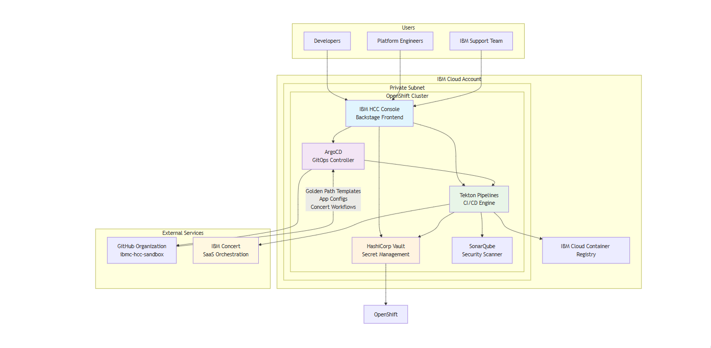

# Control Plane Documentation

## Overview

The Control Plane is a comprehensive platform engineering solution that provides developers and platform engineers with advanced capabilities for managing hybrid cloud infrastructure. Built on a foundation of enterprise-grade tools and best practices, the Control Plane enables organizations to streamline operations through standardized Golden Path Templates, automated CI/CD pipelines, and robust security controls.

The IBM Consulting Hybrid Cloud Console (HCC) serves as the primary frontend component within this Control Plane ecosystem, providing a unified interface for platform operations.

## Architecture Overview

## System Components

### Core Infrastructure

#### **IBM Cloud OpenShift Cluster**
- **Purpose**: Container orchestration platform hosting all HCC components
- **Location**: Private subnet within IBM Cloud account
- **Access**: Internal exposure to IBM Support team
- **Features**:
  - Enterprise-grade security and monitoring
  - High availability and scalability
  - Integrated logging and observability

#### **IBM Cloud Account**
- **Type**: Enterprise account
- **Services**: Compute, networking, storage, managed services
- **Security**: Private subnet deployment with controlled access

### Frontend Layer

#### **IBM Consulting Hybrid Cloud Console (HCC)**
- **Technology**: Backstage framework with custom IBM plugins
- **URL**: https://console.hcc.eu-de-sbx.cloudaccelerator.ibm.com/
- **Primary Functions**:
  - OS patching operations
  - Infrastructure blueprint design
  - Golden Path Template deployment
  - Platform engineering workflows
- **Users**: Developers and Platform Engineers

### Orchestration & Automation

#### **Tekton Pipeline Engine**
- **Purpose**: Cloud-native CI/CD pipeline orchestration
- **Integration**: IBM Concert workflows for complex multi-cloud automation
- **Capabilities**:
  - Golden Path Template execution
  - Infrastructure deployment automation
  - Security scanning integration
  - Multi-cloud orchestration

#### **IBM Concert Workflow Orchestrator**
- **Type**: SaaS Platform
- **URL**: https://aws.console.saas.ibm.com/account/dashboard
- **Function**: Backend automation for complex multi-cloud deployments
- **Integration**: Seamless integration with Tekton pipelines

### GitOps & Source Control

#### **ArgoCD GitOps Controller**
- **URL**: https://gitops.hcc.eu-de-sbx.cloudaccelerator.ibm.com/applications
- **Function**: Continuous deployment and application synchronization
- **Monitors**:
  - Application deployment manifests
  - Tekton pipeline configurations
  - Infrastructure definitions
- **Source**: GitHub organization repositories

#### **GitHub Organization**
- **URL**: https://github.com/ibmc-hcc-sandbox/
- **Contents**:
  - Application source code and configurations
  - Golden Path Templates
  - Concert workflow YAML definitions
  - Infrastructure as Code (IaC)
- **Authentication**: GitHub Auth SSO integration

### Security & Compliance

#### **HashiCorp Vault**
- **URL**: https://vault.hcc.eu-de-sbx.cloudaccelerator.ibm.com/
- **Purpose**: Enterprise secret management
- **Scope**: All sensitive data for the HCC ecosystem
- **Secrets Managed**:
  - API keys and tokens
  - Certificates and cryptographic keys
  - Configuration secrets
  - Database credentials

#### **SonarQube Security Scanner**
- **Integration**: Embedded in CI/CD pipelines
- **Function**: Code quality and vulnerability analysis
- **Scope**: All deployed code must pass security standards

### Container Registry

#### **IBM Cloud Container Registry**
- **Purpose**: Enterprise container image storage
- **Images Hosted**:
  - Tekton task images
  - HCC application images
  - Custom workflow containers
- **Features**:
  - Vulnerability scanning
  - Compliance controls
  - Image signing and verification

## Golden Path Templates

Golden Path Templates are standardized, pre-configured deployment patterns that accelerate development while ensuring consistency and best practices.

### Key Features
- **Standardization**: Consistent deployment patterns across teams
- **Best Practices**: Built-in security, monitoring, and compliance
- **Accelerated Development**: Rapid infrastructure provisioning
- **Quality Assurance**: Pre-tested and validated configurations

### Template Categories
1. **Application Deployment Templates**
2. **Infrastructure Provisioning Templates**
3. **Security Configuration Templates**
4. **Monitoring and Observability Templates**

## Authentication & Access Control

All components utilize **GitHub Auth** as the Single Sign-On (SSO) provider, ensuring:
- Centralized identity management
- Consistent access controls
- Audit trail and compliance
- Simplified user experience

## Network Architecture

### Private Subnet Design
- **Security**: All components deployed in IBM Cloud private subnet
- **Access Control**: Limited exposure with controlled ingress points
- **Internal Networking**: Secure communication between components
- **External Integration**: Controlled outbound access to GitHub and IBM Concert

### Access Patterns
- **Developers/Platform Engineers**: Browser-based access to HCC Console
- **IBM Support Team**: Internal network access to all components
- **Automated Systems**: API-based integration between components

## Operational Excellence

### Monitoring & Observability
- OpenShift native monitoring and logging
- Custom dashboards for platform metrics
- Alerting and incident management
- Performance tracking and optimization

### Backup & Disaster Recovery
- Regular backups of critical configurations
- Multi-zone deployment for high availability
- Disaster recovery procedures and testing
- Data retention and compliance policies

### Security Posture
- Zero-trust security model
- Regular security assessments
- Compliance with enterprise standards
- Continuous vulnerability management

## Getting Started

### For Developers
1. Access the HCC Console at https://console.hcc.eu-de-sbx.cloudaccelerator.ibm.com/
2. Authenticate using GitHub credentials
3. Browse available Golden Path Templates
4. Deploy infrastructure using scaffolder templates

### For Platform Engineers
1. Access advanced platform management features
2. Create and manage Golden Path Templates
3. Monitor system health and performance
4. Manage security policies and compliance

### For Operations Teams
1. Monitor system health via OpenShift console
2. Manage secrets through Vault interface
3. Review deployment status in ArgoCD
4. Analyze code quality in SonarQube

## Additional Documentation

### User Guides
- **[Blueprint Designer Guide](blueprint-designer.md)** - Comprehensive guide for designing and deploying infrastructure blueprints using the HCC Blueprint Designer

### Component Documentation
- **[HCC Console](components/hcc-console.md)** - Detailed technical documentation for the HCC Console component
- **[Tekton Pipelines](components/tekton-pipelines.md)** - CI/CD pipeline configuration and management

### Developer Resources
- **[Developer Onboarding](onboarding/developer-guide.md)** - Getting started guide for new developers
- **[API Integration](api/integration-guide.md)** - API integration documentation

### Operations
- **[Runbooks](operations/runbooks.md)** - Operational procedures and troubleshooting guides
- **[Security & Compliance](security/security-compliance.md)** - Security policies and compliance documentation

## Support & Documentation

- **Primary Console**: https://console.hcc.eu-de-sbx.cloudaccelerator.ibm.com/
- **Secret Management**: https://vault.hcc.eu-de-sbx.cloudaccelerator.ibm.com/
- **GitOps Management**: https://gitops.hcc.eu-de-sbx.cloudaccelerator.ibm.com/applications
- **Source Code**: https://github.com/ibmc-hcc-sandbox/
- **Orchestration**: https://aws.console.saas.ibm.com/account/dashboard

For technical support and escalation, contact the IBM HCC Platform Engineering team.
