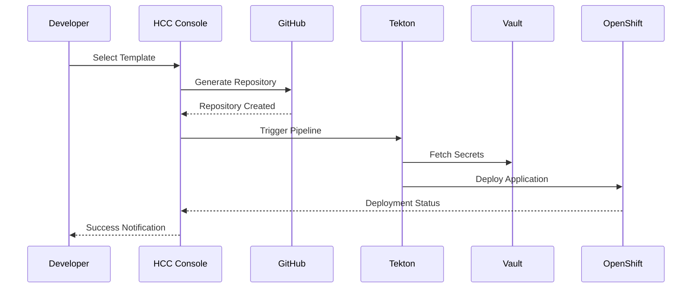

# IBM HCC Developer Onboarding Guide

## Welcome to IBM Consulting Hybrid Cloud Console (HCC)

This guide will help you get started with the IBM HCC Control Plane, understand the platform capabilities, and begin using Golden Path Templates for your development and deployment needs.

## Prerequisites

### Required Access
- **GitHub Account**: Member of `ibmc-hcc-sandbox` organization
- **IBM Cloud Account**: Access to IBM Cloud resources
- **VPN Access**: Connection to IBM internal network (for OpenShift console)
- **Multi-Factor Authentication**: Enabled on all accounts

### Required Tools
```bash
# Install kubectl
curl -LO "https://dl.k8s.io/release/$(curl -L -s https://dl.k8s.io/release/stable.txt)/bin/linux/amd64/kubectl"
chmod +x kubectl
sudo mv kubectl /usr/local/bin/

# Install OpenShift CLI
wget https://mirror.openshift.com/pub/openshift-v4/clients/ocp/stable/openshift-client-linux.tar.gz
tar -xzf openshift-client-linux.tar.gz
sudo mv oc /usr/local/bin/

# Install Tekton CLI
curl -LO https://github.com/tektoncd/cli/releases/download/v0.32.0/tkn_0.32.0_Linux_x86_64.tar.gz
tar xvzf tkn_0.32.0_Linux_x86_64.tar.gz
sudo mv tkn /usr/local/bin/

# Install Vault CLI
wget https://releases.hashicorp.com/vault/1.15.0/vault_1.15.0_linux_amd64.zip
unzip vault_1.15.0_linux_amd64.zip
sudo mv vault /usr/local/bin/
```

## Getting Started

### Step 1: Access the HCC Console

1. **Navigate to HCC Console**
   - URL: https://console.hcc.eu-de-sbx.cloudaccelerator.ibm.com/
   - Login with your GitHub credentials

2. **First-Time Setup**
   ```bash
   # Verify your GitHub organization membership
   curl -H "Authorization: token YOUR_GITHUB_TOKEN" \
     https://api.github.com/orgs/ibmc-hcc-sandbox/members/YOUR_USERNAME
   ```

3. **Console Overview**
   - **Software Catalog**: Browse available services and components
   - **Create Component**: Deploy new services using templates
   - **API Docs**: Explore API documentation
   - **TechDocs**: Access technical documentation

### Step 2: Understanding the Platform

#### Architecture Overview
```
┌─────────────────────────────────────────────────────────────┐
│                    IBM HCC Console                          │
│                  (Developer Interface)                      │
└─────────────────┬───────────────────────────────────────────┘
                  │
    ┌─────────────┴─────────────┬─────────────────────────────┐
    │                           │                             │
┌───▼────┐              ┌──────▼──────┐              ┌──────▼──────┐
│ Tekton │              │    Vault    │              │   ArgoCD    │
│Pipelines│              │  (Secrets)  │              │  (GitOps)   │
└───┬────┘              └─────────────┘              └─────────────┘
    │
┌───▼────────────────────────────────────────────────────────────┐
│                 OpenShift Cluster                              │
│              (Runtime Platform)                                │
└────────────────────────────────────────────────────────────────┘
```

#### Key Concepts

**Golden Path Templates**
- Pre-configured, tested deployment patterns
- Include security, monitoring, and compliance best practices
- Reduce development time and ensure consistency

**Scaffolder**
- Template deployment engine
- Guided parameter collection
- Automated code generation and deployment

**Software Catalog**
- Central registry of all platform services
- Dependency tracking and visualization
- Health monitoring and alerts

### Step 3: Your First Deployment

#### Deploy a Sample Application

1. **Access the Software Catalog**
   - Navigate to "Create Component" in HCC Console
   - Browse available Golden Path Templates

2. **Select Template**
   ```yaml
   # Example: Microservice Template
   Template: "Spring Boot Microservice"
   Description: "Production-ready Spring Boot application with monitoring"
   Technologies: [Java, Spring Boot, PostgreSQL, Prometheus]
   ```

3. **Configure Parameters**
   ```yaml
   # Required Parameters
   Application Name: my-first-app
   Owner: your-github-username
   Description: My first HCC application
   
   # Optional Parameters
   Database: PostgreSQL
   Monitoring: Enabled
   Security Scanning: Enabled
   Environment: development
   ```

4. **Review Generated Resources**
   ```
   Generated Files:
   ├── src/
   │   └── main/java/com/example/MyFirstApp.java
   ├── Dockerfile
   ├── kubernetes/
   │   ├── deployment.yaml
   │   ├── service.yaml
   │   └── configmap.yaml
   ├── .tekton/
   │   └── pipeline.yaml
   └── README.md
   ```

5. **Monitor Deployment**
   - Pipeline execution in Tekton dashboard
   - Application status in ArgoCD
   - Service health in HCC Console

#### Deployment Process Flow


## Working with Golden Path Templates

### Available Template Categories

#### **Application Templates**

**Microservice Templates**
- Spring Boot Microservice
- Node.js Express API
- Python FastAPI
- Go Gin Service

```yaml
# Example: Spring Boot Template Structure
apiVersion: scaffolder.backstage.io/v1beta3
kind: Template
meta
  name: spring-boot-microservice
  title: Spring Boot Microservice
  description: Production-ready Spring Boot microservice
spec:
  owner: platform-team
  type: service
  parameters:
    - title: Application Information
      required:
        - name
        - owner
      properties:
        name:
          title: Name
          type: string
          pattern: '^[a-zA-Z0-9-]+$'
        owner:
          title: Owner
          type: string
          ui:field: OwnerPicker
        description:
          title: Description
          type: string
  steps:
    - id: fetch
      name: Fetch Template
      action: fetch:template
      input:
        url: ./skeleton
        values:
          name: ${{ parameters.name }}
          owner: ${{ parameters.owner }}
    - id: publish
      name: Publish Repository
      action: publish:github
      input:
        repoUrl: github.com?repo=${{ parameters.name }}&owner=ibmc-hcc-sandbox
```

#### **Infrastructure Templates**

**Database Services**
- PostgreSQL Cluster
- MongoDB Replica Set
- Redis Cache
- Elasticsearch Cluster

**Monitoring Stack**
- Prometheus + Grafana
- ELK Stack
- Jaeger Tracing
- Custom Metrics Dashboard

### Template Customization

#### Adding Custom Parameters
```yaml
parameters:
  - title: Database Configuration
    properties:
      database_type:
        title: Database Type
        type: string
        enum:
          - postgresql
          - mysql
          - mongodb
        default: postgresql
      database_size:
        title: Database Size
        type: string
        enum:
          - small
          - medium
          - large
        default: small
      backup_enabled:
        title: Enable Backups
        type: boolean
        default: true
```

#### Template Variables
```yaml
# In template files, use substitution variables:
apiVersion: apps/v1
kind: Deployment
meta
  name: ${{ values.name }}
  labels:
    app: ${{ values.name }}
    owner: ${{ values.owner }}
spec:
  replicas: ${{ values.replicas | default(3) }}
  selector:
    matchLabels:
      app: ${{ values.name }}
```

## Development Workflow

### Standard Development Process

#### 1. **Planning Phase**
- Review requirements with platform team
- Select appropriate Golden Path Template
- Define custom parameters and configurations

#### 2. **Development Phase**
```bash
# Clone generated repository
git clone https://github.com/ibmc-hcc-sandbox/my-first-app.git
cd my-first-app

# Review generated structure
tree .
├── src/
├── tests/
├── .tekton/
├── kubernetes/
├── Dockerfile
└── README.md

# Start local development
./mvnw spring-boot:run
```

#### 3. **Testing Phase**
```bash
# Run unit tests
./mvnw test

# Run integration tests
./mvnw integration-test

# Security scanning (local)
docker run --rm -v $(pwd):/workspace sonarqube/sonar-scanner-cli \
  -Dsonar.projectKey=my-first-app \
  -Dsonar.sources=/workspace/src
```

#### 4. **Deployment Phase**
```bash
# Push changes to trigger pipeline
git add .
git commit -m "feat: add new feature"
git push origin main

# Monitor pipeline execution
tkn pipelinerun list -n hcc-pipelines
tkn pipelinerun logs -f my-first-app-run-xyz -n hcc-pipelines
```

### GitOps Workflow

#### Repository Structure
```
my-first-app/
├── src/                    # Application source code
├── .tekton/               # CI/CD pipeline definitions
│   ├── pipeline.yaml
│   ├── tasks/
│   └── triggers/
├── k8s/                   # Kubernetes manifests
│   ├── base/
│   │   ├── deployment.yaml
│   │   ├── service.yaml
│   │   └── kustomization.yaml
│   └── overlays/
│       ├── dev/
│       ├── staging/
│       └── prod/
├── docs/                  # Documentation
└── README.md
```

#### Promotion Process
```bash
# Development to Staging
git checkout -b promote/staging
# Update image tags in k8s/overlays/staging/
git commit -m "promote: deploy to staging"
git push origin promote/staging
# Create Pull Request

# Staging to Production (after approval)
git checkout -b promote/production  
# Update image tags in k8s/overlays/prod/
git commit -m "promote: deploy to production"
git push origin promote/production
# Create Pull Request with required approvals
```

## Security Best Practices

### Secret Management

#### Using Vault Secrets
```yaml
# In your application deployment
apiVersion: apps/v1
kind: Deployment
spec:
  template:
    metadata:
      annotations:
        vault.hashicorp.com/agent-inject: "true"
        vault.hashicorp.com/role: "my-first-app"
        vault.hashicorp.com/agent-inject-secret-database: "database/creds/myapp"
    spec:
      serviceAccountName: my-first-app
      containers:
      - name: app
        image: my-first-app:latest
        env:
        - name: DATABASE_URL
          value: "file:///vault/secrets/database"
```

#### Accessing Secrets in Code
```java
// Spring Boot example
@Configuration
public class DatabaseConfig {
    
    @Value("${database.url:file:///vault/secrets/database}")
    private String databaseCredentialsFile;
    
    @Bean
    public DataSource dataSource() {
        // Read credentials from Vault-injected file
        Properties props = loadFromFile(databaseCredentialsFile);
        return DataSourceBuilder.create()
            .url(props.getProperty("url"))
            .username(props.getProperty("username"))
            .password(props.getProperty("password"))
            .build();
    }
}
```

### Security Scanning

#### Pre-commit Hooks
```bash
# Install pre-commit
pip install pre-commit

# .pre-commit-config.yaml
repos:
- repo: https://github.com/pre-commit/pre-commit-hooks
  rev: v4.4.0
  hooks:
  - id: trailing-whitespace
  - id: end-of-file-fixer
- repo: https://github.com/psf/black
  rev: 22.3.0
  hooks:
  - id: black
- repo: https://github.com/PyCQA/bandit
  rev: 1.7.4
  hooks:
  - id: bandit
```

#### Container Security
```dockerfile
# Secure Dockerfile example
FROM registry.redhat.io/ubi8/openjdk-11:latest

# Create non-root user
USER 1001

# Copy application
COPY target/*.jar app.jar

# Security labels
LABEL security.non-root=true
LABEL security.no-new-privileges=true

# Health check
HEALTHCHECK --interval=30s --timeout=3s --start-period=5s --retries=3 \
  CMD curl -f http://localhost:8080/actuator/health || exit 1

# Run application
ENTRYPOINT ["java", "-jar", "/app.jar"]
```

## Monitoring and Debugging

### Application Monitoring

#### Prometheus Metrics
```java
// Spring Boot Actuator + Micrometer
@RestController
public class MetricsController {
    
    private final MeterRegistry meterRegistry;
    private final Counter requestCounter;
    
    public MetricsController(MeterRegistry meterRegistry) {
        this.meterRegistry = meterRegistry;
        this.requestCounter = Counter.builder("api_requests_total")
            .description("Total API requests")
            .register(meterRegistry);
    }
    
    @GetMapping("/api/data")
    public ResponseEntity<Data> getData() {
        requestCounter.increment();
        // ... business logic
        return ResponseEntity.ok(data);
    }
}
```

#### Custom Dashboards
```yaml
# Grafana Dashboard ConfigMap
apiVersion: v1
kind: ConfigMap
meta
  name: my-app-dashboard

  dashboard.json: |
    {
      "dashboard": {
        "title": "My First App Dashboard",
        "panels": [
          {
            "title": "Request Rate",
            "type": "graph",
            "targets": [
              {
                "expr": "rate(api_requests_total[5m])"
              }
            ]
          }
        ]
      }
    }
```

### Debugging Tools

#### Log Aggregation
```bash
# View application logs
oc logs deployment/my-first-app -f

# Search logs with specific patterns
oc logs deployment/my-first-app | grep "ERROR"

# Export logs for analysis
oc logs deployment/my-first-app --since=1h > app.log
```

#### Performance Debugging
```bash
# Check resource usage
kubectl top pod -l app=my-first-app

# Get pod details
kubectl describe pod -l app=my-first-app

# Port forward for local debugging
kubectl port-forward deployment/my-first-app 8080:8080
```

## Advanced Topics

### Custom Task Development

#### Creating Custom Tekton