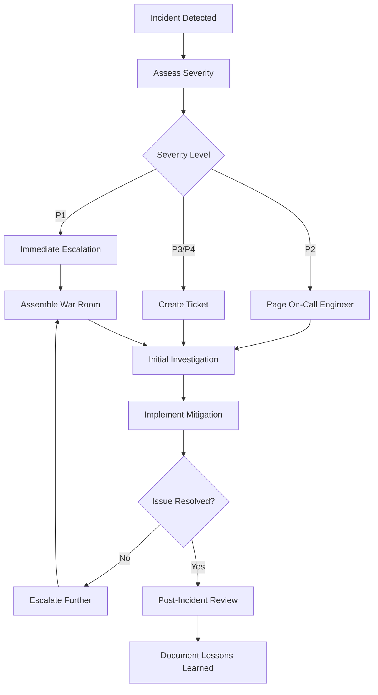

# IBM HCC Control Plane - Operational Runbooks

## Overview

This document provides operational procedures and runbooks for maintaining the IBM Consulting Hybrid Cloud Console (HCC) Control Plane. These runbooks are designed for platform operators, SREs, and support teams responsible for day-to-day operations.

## Emergency Contacts

### Escalation Matrix
- **L1 Support**: IBM HCC Operations Team
- **L2 Support**: Platform Engineering Team
- **L3 Support**: Architecture Team
- **Emergency**: IBM Critical Systems Response

### Contact Information
```
Operations Team: hcc-ops@ibm.com
Platform Team: hcc-platform@ibm.com
Architecture: hcc-architecture@ibm.com
Emergency: +1-800-IBM-HELP
```

## System Health Monitoring

### Health Check Endpoints

#### HCC Console
```bash
# Application Health
curl -s https://console.hcc.eu-de-sbx.cloudaccelerator.ibm.com/api/health

# Expected Response
{
  "status": "healthy",
  "timestamp": "2024-01-15T10:30:00Z",
  "checks": {
    "database": "healthy",
    "vault": "healthy", 
    "kubernetes": "healthy"
  }
}
```

#### Vault
```bash
# Vault Seal Status
curl -s https://vault.hcc.eu-de-sbx.cloudaccelerator.ibm.com/v1/sys/seal-status

# Expected Response
{
  "sealed": false,
  "t": 3,
  "n": 5,
  "progress": 0,
  "type": "shamir",
  "cluster_name": "hcc-vault",
  "cluster_id": "abc123..."
}
```

#### ArgoCD
```bash
# ArgoCD Health
curl -s https://gitops.hcc.eu-de-sbx.cloudaccelerator.ibm.com/api/version

# Application Status
argocd app list --server gitops.hcc.eu-de-sbx.cloudaccelerator.ibm.com
```

#### Tekton
```bash
# Pipeline Controller Status
kubectl get pods -n tekton-pipelines -l app.kubernetes.io/name=controller

# Recent Pipeline Runs
tkn pipelinerun list --limit 10
```

### Automated Monitoring Scripts

#### System Health Check Script
```bash
#!/bin/bash
# health-check.sh - Comprehensive system health check

set -e

NAMESPACE="hcc-system"
LOGFILE="/var/log/hcc-health-check.log"

log() {
    echo "$(date '+%Y-%m-%d %H:%M:%S') - $1" | tee -a $LOGFILE
}

check_hcc_console() {
    log "Checking HCC Console..."
    
    # Check pod status
    if kubectl get pods -n $NAMESPACE -l app=hcc-console --no-headers | grep -q "Running"; then
        log "✓ HCC Console pods are running"
    else
        log "✗ HCC Console pods are not healthy"
        kubectl get pods -n $NAMESPACE -l app=hcc-console
        return 1
    fi
    
    # Check endpoint
    if curl -sf https://console.hcc.eu-de-sbx.cloudaccelerator.ibm.com/api/health > /dev/null; then
        log "✓ HCC Console health endpoint responding"
    else
        log "✗ HCC Console health endpoint not responding"
        return 1
    fi
}

check_vault() {
    log "Checking Vault..."
    
    # Check seal status
    VAULT_STATUS=$(curl -s https://vault.hcc.eu-de-sbx.cloudaccelerator.ibm.com/v1/sys/seal-status)
    SEALED=$(echo $VAULT_STATUS | jq -r '.sealed')
    
    if [ "$SEALED" = "false" ]; then
        log "✓ Vault is unsealed"
    else
        log "✗ Vault is sealed - requires manual intervention"
        return 1
    fi
}

check_tekton() {
    log "Checking Tekton Pipelines..."
    
    # Check controller
    if kubectl get pods -n tekton-pipelines -l app.kubernetes.io/name=controller --no-headers | grep -q "Running"; then
        log "✓ Tekton controller is running"
    else
        log "✗ Tekton controller is not healthy"
        return 1
    fi
    
    # Check recent pipeline success rate
    RECENT_RUNS=$(tkn pipelinerun list --limit 10 -o json | jq '[.items[] | select(.status.conditions[0].status == "True")] | length')
    TOTAL_RUNS=$(tkn pipelinerun list --limit 10 -o json | jq '.items | length')
    
    if [ $TOTAL_RUNS -gt 0 ]; then
        SUCCESS_RATE=$((RECENT_RUNS * 100 / TOTAL_RUNS))
        log "Pipeline success rate: ${SUCCESS_RATE}%"
        
        if [ $SUCCESS_RATE -lt 80 ]; then
            log "⚠ Low pipeline success rate detected"
        fi
    fi
}

check_argocd() {
    log "Checking ArgoCD..."
    
    # Check application health
    APP_COUNT=$(argocd app list -o json | jq '[.[] | select(.status.health.status == "Healthy")] | length')
    TOTAL_APPS=$(argocd app list -o json | jq '. | length')
    
    log "Healthy applications: ${APP_COUNT}/${TOTAL_APPS}"
    
    if [ $APP_COUNT -ne $TOTAL_APPS ]; then
        log "⚠ Some applications are not healthy"
        argocd app list | grep -v "Healthy"
    fi
}

# Main execution
main() {
    log "Starting HCC Control Plane health check..."
    
    check_hcc_console
    check_vault
    check_tekton
    check_argocd
    
    log "Health check completed successfully"
}

# Run health check
main "$@"
```

## Incident Response Procedures

### Severity Definitions

#### P1 - Critical (Response: 15 minutes)
- Complete system outage
- Security breach
- Data corruption

#### P2 - High (Response: 1 hour)
- Major functionality degraded
- Performance severely impacted
- Key integrations failing

#### P3 - Medium (Response: 4 hours)
- Minor functionality issues
- Non-critical feature failures
- Documentation gaps

#### P4 - Low (Response: 24 hours)
- Enhancement requests
- Cosmetic issues
- Minor improvements

### Incident Response Workflow



## Component-Specific Runbooks

### HCC Console Runbook

#### Console Not Responding

**Symptoms:**
- HTTP 500/502/503 errors
- Timeouts accessing console
- User authentication failures

**Investigation Steps:**
```bash
# 1. Check pod status
kubectl get pods -n hcc-system -l app=hcc-console

# 2. Check pod logs
kubectl logs -f deployment/hcc-console -n hcc-system --tail=100

# 3. Check service endpoints
kubectl get endpoints hcc-console-service -n hcc-system

# 4. Check ingress/route
oc get route hcc-console -n hcc-system

# 5. Test internal connectivity
kubectl exec -it deployment/hcc-console -n hcc-system -- curl localhost:7007/healthz
```

**Mitigation Steps:**
```bash
# 1. Restart pods if unhealthy
kubectl rollout restart deployment/hcc-console -n hcc-system

# 2. Scale up if resource constrained
kubectl scale deployment/hcc-console --replicas=5 -n hcc-system

# 3. Check resource limits
kubectl describe pod -l app=hcc-console -n hcc-system | grep -A 10 "Limits:"

# 4. Validate configuration
kubectl get configmap hcc-console-config -n hcc-system -o yaml
```

#### Database Connection Issues

**Symptoms:**
- Database connection timeouts
- PostgreSQL connection errors
- Slow query performance

**Investigation Steps:**
```bash
# 1. Check PostgreSQL pod status
kubectl get pods -n hcc-system -l app=postgresql

# 2. Check database connectivity
kubectl exec -it deployment/hcc-console -n hcc-system -- \
  pg_isready -h postgresql.hcc-system.svc.cluster.local -p 5432

# 3. Check database performance
kubectl exec -it deployment/postgresql -n hcc-system -- \
  psql -U backstage -c "SELECT * FROM pg_stat_activity WHERE state = 'active';"

# 4. Check connection pool
kubectl logs deployment/hcc-console -n hcc-system | grep -i "connection pool"
```

**Mitigation Steps:**
```bash
# 1. Restart database connection
kubectl rollout restart deployment/hcc-console -n hcc-system

# 2. Scale database if needed
kubectl scale deployment/postgresql --replicas=1 -n hcc-system

# 3. Clear stale connections
kubectl exec -it deployment/postgresql -n hcc-system -- \
  psql -U backstage -c "SELECT pg_terminate_backend(pid) FROM pg_stat_activity WHERE state = 'idle';"
```

### Vault Runbook

#### Vault Sealed

**Symptoms:**
- Vault returns sealed status
- Applications cannot access secrets
- Authentication failures

**Investigation Steps:**
```bash
# 1. Check seal status
curl -s https://vault.hcc.eu-de-sbx.cloudaccelerator.ibm.com/v1/sys/seal-status

# 2. Check Vault pods
kubectl get pods -n vault-system -l app.kubernetes.io/name=vault

# 3. Check Vault logs
kubectl logs -f statefulset/vault -n vault-system
```

**Mitigation Steps:**
```bash
# 1. Unseal Vault (requires unseal keys)
vault operator unseal <key-1>
vault operator unseal <key-2>
vault operator unseal <key-3>

# 2. If auto-unseal is configured, restart Vault pods
kubectl delete pods -l app.kubernetes.io/name=vault -n vault-system

# 3. Verify unsealed status
vault status
```

#### Secret Access Issues

**Investigation Steps:**
```bash
# 1. Check Vault authentication
vault auth -method=kubernetes role=hcc-console

# 2. Test secret read
vault kv get secret/hcc/database

# 3. Check policies
vault policy read hcc-console-policy

# 4. Verify service account token
kubectl get serviceaccount hcc-console -n hcc-system -o yaml
```

### Tekton Runbook

#### Pipeline Failures

**Symptoms:**
- High pipeline failure rate
- Pipelines stuck in pending
- Resource allocation failures

**Investigation Steps:**
```bash
# 1. List recent pipeline runs
tkn pipelinerun list --limit 20

# 2. Check failed pipeline logs
tkn pipelinerun logs <failed-run-name>

# 3. Check cluster resources
kubectl top nodes
kubectl describe nodes | grep -A 5 "Allocated resources"

# 4. Check pending pods
kubectl get pods --field-selector=status.phase=Pending -A
```

**Mitigation Steps:**
```bash
# 1. Cancel stuck pipelines
tkn pipelinerun cancel <stuck-run-name>

# 2. Clean up old pipeline runs
kubectl delete pipelinerun --field-selector=status.completionTime!=null -n hcc-pipelines

# 3. Scale cluster nodes if needed
# (Follow cluster scaling procedures)

# 4. Restart Tekton controller
kubectl rollout restart deployment/tekton-pipelines-controller -n tekton-pipelines
```

#### Task Resource Issues

**Investigation Steps:**
```bash
# 1. Check task resource requests
kubectl get taskrun <task-run-name> -o yaml | grep -A 10 "resources:"

# 2. Check node capacity
kubectl describe nodes | grep -A 15 "Capacity:"

# 3. Check resource quotas
kubectl get resourcequota -A

# 4. Check limit ranges
kubectl get limitrange -A
```

### ArgoCD Runbook

#### Application Sync Failures

**Symptoms:**
- Applications showing OutOfSync status
- Sync operations failing
- Git repository connection issues

**Investigation Steps:**
```bash
# 1. Check application status
argocd app list

# 2. Get detailed app info
argocd app get <app-name>

# 3. Check sync history
argocd app history <app-name>

# 4. Check ArgoCD controller logs
kubectl logs -f deployment/argocd-application-controller -n argocd
```

**Mitigation Steps:**
```bash
# 1. Force sync application
argocd app sync <app-name> --force

# 2. Refresh application
argocd app refresh <app-name>

# 3. Reset application to HEAD
argocd app sync <app-name> --revision HEAD

# 4. Check Git repository connectivity
argocd repo list
argocd repo get https://github.com/ibmc-hcc-sandbox/<repo-name>
```

#### Repository Access Issues

**Investigation Steps:**
```bash
# 1. Test repository access
argocd repo list

# 2. Check repository credentials
kubectl get secret -n argocd -l argocd.argoproj.io/secret-type=repository

# 3. Validate SSH keys or tokens
argocd repo add https://github.com/ibmc-hcc-sandbox/test-repo --username <user> --password <token>

# 4. Check network connectivity
kubectl run -it --rm debug --image=busybox --restart=Never -- nslookup github.com
```

## Backup and Recovery Procedures

### Backup Schedule

#### Daily Backups
- **Vault Snapshots**: Automated Vault data backup
- **Database Exports**: PostgreSQL database dumps
- **Configuration**: Kubernetes configurations and secrets

#### Weekly Backups
- **Full System State**: Complete cluster backup
- **Git Repositories**: Repository mirrors
- **Container Images**: Image registry backup

#### Monthly Backups
- **Long-term Archive**: Historical data preservation
- **Disaster Recovery Test**: Full system restore test

### Backup Scripts

#### Vault Backup
```bash
#!/bin/bash
# vault-backup.sh

BACKUP_DIR="/backup/vault/$(date +%Y%m%d)"
VAULT_ADDR="https://vault.hcc.eu-de-sbx.cloudaccelerator.ibm.com"

mkdir -p $BACKUP_DIR

# Create Vault snapshot
vault operator raft snapshot save $BACKUP_DIR/vault-snapshot-$(date +%Y%m%d-%H%M%S).snap

# Backup Vault policies
vault policy list | while read policy; do
    vault policy read $policy > $BACKUP_DIR/policy-$policy.hcl
done

# Backup auth methods
vault auth list -format=json > $BACKUP_DIR/